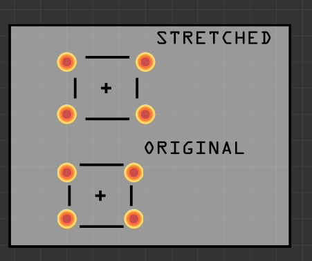

# core-pushbutton-stretched
This is the standard 4-Pin Pushbutton, stretched to fit a 100mil (0.1in)
grid.

Naturally this is based on the original files from [fritzing/fritzing-parts](https://github.com/fritzing/fritzing-parts/)