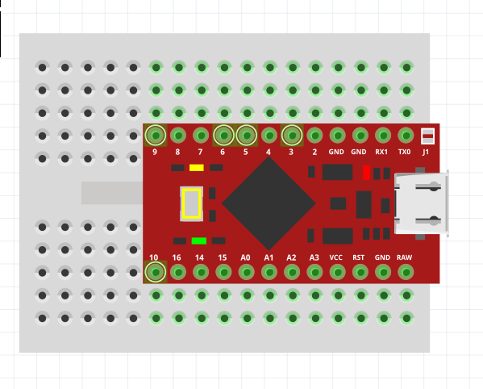
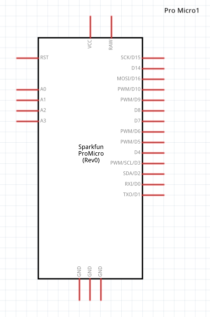
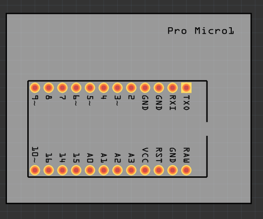

# sparkfun-pro-micro
This is a part for the awesome [Pro Micro](https://github.com/sparkfun/Pro_Micro) by SparkFun.

The breadboard SVG and icon were created by Jeremy Lee  [unorthodox-engineers/unorthodox-arduino/](https://github.com/unorthodox-engineers/unorthodox-arduino/).

The Schematic is based on the schematic for the Arduino Leonardo by Fritzing [fritzing/fritzing-parts](https://github.com/fritzing/fritzing-parts/).

The PCB is based on a Fritzing Mystery Part.

## Screenshots
  

